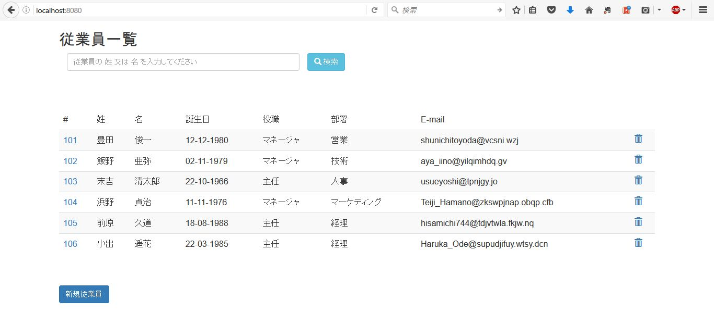

# Oracle Application Container Cloud Service - 組み込み Tomcat と Bootstrap を用いた Web アプリケーション開発
---
## 説明

Web アプリケーションは、通常 **Web コンテナ** や、**Serevlet コンテナ** と呼ばれるコンポーネント上にデプロイされます。主な Web コンテナには、オープン・ソースでは *Tomcat*、*GlassFish*、*JBoss* などがあり、商用製品では *WebLogic Application Server* や、*WebSphere Application Server* があります。
しかし、**組み込みサーバ** を使用すると、Web アプリケーションをデプロイする代わりに、アプリケーション内にサーバ機能を組み込むことができます。これによって、JAR としてパッケージされたスタンド・アローン・アプリケーションとして、コマンドラインから実行する事が可能になります。

Tomcat 7 から組み込みサーバの機能を備えています。
- [参考: Embedding Tomcat 7](http://www.copperykeenclaws.com/embedding-tomcat-7/)

この組み込みサーバとして **Tomcat** を使用した、Servet / JSP / Bootstrap による Web アプリケーションを作成し、Application Container Cloud Service にデプロイします。

## 作成するアプリケーション

CRUD 操作を行うシンプルな Web アプリケーションを作成します。ユーザ・インターフェース・スタイルは、**Bootstrap** を使用します。そして、組み込みサーバとして **Tomcat** を使用し、アプリケーションの依存ライブラリを解決してコンパイル、パッケージするために **Maven** を利用します。

## 前提

- [Maven 3.3.1 以上](https://maven.apache.org/)
- [Java SE 8u45 以降](http://www.oracle.com/technetwork/java/javase/downloads/index.html)
- [Bootstrap v3.3.7](http://getbootstrap.com/)

## 手順

### Maven プロジェクトの作成

Maven プロジェクトを作成するディレクトリに移動し、次のコマンドを実行しプロジェクトを作成します:

```bash
$ mvn archetype:generate \
-DarchetypeGroupId=org.apache.maven.archetypes \
-DarchetypeArtifactId=maven-archetype-webapp \
-DarchetypeVersion=1.0
-DinteractiveMode=false \
-DgroupId=com.example.employees \
-DartifactId=employees-app \
```

- DarchetypeGroupId: ひな形となるアーキタイプの指定 / グループ名
- DarchetypeArtifactId: ひな形となるアーキタイプの指定 / アーティファクト名
- DarchetypeVersion: ひな形となるアーキタイプの指定 / バージョン
- DinteractiveMode: 対話形式でのパラメータ指定の可否
- DgroupId: 生成するプロジェクトの情報 / グループ名
- DartifactId: 生成するプロジェクトの情報 / アーティファクト名

```bash
[INFO] Scanning for projects...
Downloading: https://repo.maven.apache.org/maven2/org/apache/maven/plugins/maven-deploy-plugin/2.7/maven-deploy-plugin-2.7.pom
...
...
...
[INFO]
[INFO] ------------------------------------------------------------------------
[INFO] Building Maven Stub Project (No POM) 1
[INFO] ------------------------------------------------------------------------
[INFO]
[INFO] >>> maven-archetype-plugin:2.4:generate (default-cli) > generate-sources @ standalone-pom >>>
[INFO]
[INFO] <<< maven-archetype-plugin:2.4:generate (default-cli) < generate-sources @ standalone-pom <<<
[INFO]
[INFO] --- maven-archetype-plugin:2.4:generate (default-cli) @ standalone-pom ---
...
...
...
[INFO] ------------------------------------------------------------------------
[INFO] BUILD SUCCESS
[INFO] ------------------------------------------------------------------------
[INFO] Total time: 31.053 s
[INFO] Finished at: 2016-12-14T18:35:57+09:00
[INFO] Final Memory: 14M/153M
[INFO] ------------------------------------------------------------------------
```

これにより、プロジェクト・ディレクトリ構造が作成され、依存するライブラリがダウンロードされました。

```bash
$ tree employees-app/
employees-app/
├── pom.xml
└── src
    └── main
        ├── resources
        └── webapp
            ├── index.jsp
            └── WEB-INF
                └── web.xml

5 directories, 3 files
```

作成したプロジェクトを *Eclipse* や *NetBeans* などの統合開発環境で開く事ができます。

### pom.xml の設定

プロジェクトのルート・ディレクトリに配置されている、***pom.xml*** を開きます。
`<dependencies>` タグの手前に `<properties>` タグを追加し、**Tomcat** のバージョンを指定します。
こここでは、7系の最新版(as of 2016.12.14) である、7.0.73 を指定しています。

```xml
<properties>
    <tomcat.version>7.0.73</tomcat.version>
</properties>
```

次に、`<dependencies>` タグ内に、このアプリケーションに必要となる `<dependency>` を追加します。

```xml
<dependencies>
    <dependency>
        <groupId>org.apache.tomcat.embed</groupId>
        <artifactId>tomcat-embed-core</artifactId>
        <version>${tomcat.version}</version>
    </dependency>
    <dependency>
        <groupId>org.apache.tomcat.embed</groupId>
        <artifactId>tomcat-embed-logging-juli</artifactId>
        <version>${tomcat.version}</version>
    </dependency>
    <dependency>
        <groupId>org.apache.tomcat.embed</groupId>
        <artifactId>tomcat-embed-jasper</artifactId>
        <version>${tomcat.version}</version>
    </dependency>
    <dependency>
        <groupId>org.apache.tomcat</groupId>
        <artifactId>tomcat-jasper</artifactId>
        <version>${tomcat.version}</version>
    </dependency>
    <dependency>
        <groupId>org.apache.tomcat</groupId>
        <artifactId>tomcat-jasper-el</artifactId>
        <version>${tomcat.version}</version>
    </dependency>
    <dependency>
        <groupId>org.apache.tomcat</groupId>
        <artifactId>tomcat-jsp-api</artifactId>
        <version>${tomcat.version}</version>
    </dependency>
    <dependency>
        <groupId>jstl</groupId>
        <artifactId>jstl</artifactId>
        <version>1.2</version>
    </dependency>
</dependencies>
```

JSTL (JSP Standard Tag Library) は、JSP ベースのタグ・ライブラリで、JSP ページでのタグ・コレクションを提供しています。これにより、日付や数値データの書式設定や、国際化対応、またEL式などを利用できます。

### ビルド・プラグインの追加

ビルド・フェーズで使用する次のプラグインを追加します:

- **Maven Compiler Plugin** (maven-compiler-plugin): ソースのコンパイルに使用
- **Maven Assembly Plugin** (maven-assembly-plugin): 単一のアーカイブ・ファイルにモジュールや依存ライブラリをパッケージする際に使用 (Uber / Fat jar)

`<build>` 要素に `<plugins>` セクションを追加します。

```xml
<build>
    <finalName>employees-app</finalName>
    <resources>
        <resource>
            <directory>src/main/webapp</directory>
            <targetPath>META-INF/resources</targetPath>
        </resource>
    </resources>
    <plugins>
        <plugin>
            <groupId>org.apache.maven.plugins</groupId>
            <artifactId>maven-compiler-plugin</artifactId>
            <version>3.6.0</version>
            <inherited>true</inherited>
            <configuration>
                <source>1.8</source>
                <target>1.8</target>
            </configuration>
        </plugin>
        <plugin>
            <groupId>org.apache.maven.plugins</groupId>
            <artifactId>maven-assembly-plugin</artifactId>
            <version>2.2-beta-5</version>
            <configuration>
                <descriptorRefs>
                    <descriptorRef>jar-with-dependencies</descriptorRef>
                </descriptorRefs>
                <finalName>${project.build.finalName}-${project.version}</finalName>
                <archive>
                    <manifest>
                        <addClasspath>true</addClasspath>
                        <mainClass>com.oracle.jp.shinyay.employees.Main</mainClass>
                    </manifest>
                </archive>
            </configuration>
            <executions>
                <execution>
                    <phase>package</phase>
                    <goals>
                        <goal>single</goal>
                    </goals>
                </execution>
            </executions>
        </plugin>
    </plugins>
</build>  
```


## Employee モデルの作成

### Employee クラス

`src/main` 配下に **java** ソース・ディレクトリを作成し、***com.example.employees*** パッケージを作成します。そして、***Employee*** クラスを作成します。

```java
public class Employee {

    private long id;
    private String name;
    private String lastName;
    private String birthDate;
    private String role;
    private String department;
    private String email;
    private static final AtomicLong counter = new AtomicLong(100);

    public Employee(String name, String lastName, String birthDate, String role, String department, String email, long id) {
        this.name = name;
        this.lastName = lastName;
        this.birthDate = birthDate;
        this.role = role;
        this.department = department;
        this.email = email;     
        this.id = id;
    }

    public Employee(String name, String lastName, String birthDate, String role, String department, String email) {
        this.name = name;
        this.lastName = lastName;
        this.birthDate = birthDate;
        this.role = role;
        this.department = department;
        this.email = email;     
        this.id = counter.incrementAndGet();
    }

    public long getId() {
        return id;
    }

    public void setId(long id) {
        this.id = id;
    }

    public String getName() {
        return name;
    }

    public void setName(String name) {
        this.name = name;
    }

    public String getLastName() {
        return lastName;
    }

    public void setLastName(String lastName) {
        this.lastName = lastName;
    }

    public String getBirthDate() {
        return birthDate;
    }

    public void setBirthDate(String birthDate) {
        this.birthDate = birthDate;
    }

    public String getRole() {
        return role;
    }

    public void setRole(String role) {
        this.role = role;
    }

    public String getDepartment() {
        return department;
    }

    public void setDepartment(String department) {
        this.department = department;
    }

    public String getEmail() {
        return email;
    }

    public void setEmail(String email) {
        this.email = email;
    }

    @Override
    public String toString() {
        return "Employee{" + "id=" + id + ", name=" + name +
                ", lastName=" + lastName + ", birthDate=" + birthDate +
                ", role=" + role + ", department=" + department +
                ", email=" + email + '}';
    }    
}
```

### EmployeeList クラス

次に Employee オブジェクト一覧を保有する ***EmployeeList*** クラスを作成します。本来はここでデータベースを参照し、データ・オブジェクトを用意するところですが、モックとして *ArrayList* にデータをハードコードしています。

```java
public class EmployeeList {
    private static final List<Employee> employeeList = new ArrayList();

    private EmployeeList() {
    }

    static {
        employeeList.add(new Employee("俊一", "豊田", "12-12-1980", "マネージャ", "営業", "shunichitoyoda@vcsni.wzj"));
        employeeList.add(new Employee("亜弥", "飯野", "02-11-1979", "マネージャ", "技術", "\taya_iino@yilqimhdq.gv"));
        employeeList.add(new Employee("清太郎", "末吉", "22-10-1966", "主任", "人事", "usueyoshi@tpnjgy.jo"));
        employeeList.add(new Employee("貞治", "浜野", "11-11-1976", "マネージャ", "マーケティング", "Teiji_Hamano@zkswpjnap.obqp.cfb"));
        employeeList.add(new Employee("久道", "前原", "18-08-1988", "主任", "経理", "hisamichi744@tdjvtwla.fkjw.nq"));
        employeeList.add(new Employee("遥花", "小出", "22-03-1985", "主任", "経理", "Haruka_Ode@supudjifuy.wtsy.dcn"));
    }

    public static List<Employee> getInstance() {
        return employeeList;
    }
}
```

## 検索ページの作成

### EmployeeService クラス

姓または名で employee データを検索する **EmployeeService** クラスを作成します。
このクラスでは、EmployeeList インスタンスを取得し、全件取得、姓・名で検索した対象、また ID で検索した対象を返すメソッドを定義します。また、追加・更新・削除に関するメソッドも併せて定義えを行います。

```java
List<Employee> employeeList = EmployeeList.getInstance();

public List<Employee> getAllEmployees() {
    return employeeList;
}

public List<Employee> searchEmployeesByName(String name) {
    Comparator<Employee> groupByComparator = Comparator.comparing(Employee::getName)
            .thenComparing(Employee::getLastName);
    List<Employee> result = employeeList
            .stream()
            .filter(e -> e.getName().equalsIgnoreCase(name) || e.getLastName().equalsIgnoreCase(name))
            .sorted(groupByComparator)
            .collect(Collectors.toList());
    return result;
}

public Employee getEmployee(long id) throws Exception {
    Optional<Employee> match
            = employeeList.stream()
            .filter(e -> e.getId() == id)
            .findFirst();
    if (match.isPresent()) {
        return match.get();
    } else {
        throw new Exception("The Employee id " + id + " not found");
    }
}
```

### EmployeeServlet クラス

**@WebServlet** アノテーションを使用してサーブレット宣言を行います。
そして、姓・名による検索処理の追加、全件取得処理の追加を行います。

```java
protected void doGet(HttpServletRequest req, HttpServletResponse resp) throws ServletException, IOException {
    String action = req.getParameter("searchAction");
    if (action!=null){
        switch (action) {
            case "searchById":
                searchEmployeeById(req, resp);
                break;
            case "searchByName":
                searchEmployeeByName(req, resp);
                break;
        }
    }else{
        List<Employee> result = employeeService.getAllEmployees();
        forwardListEmployees(req, resp, result);
    }
}

private void searchEmployeeById(HttpServletRequest req, HttpServletResponse resp)
        throws ServletException, IOException {
    long idEmployee = Integer.valueOf(req.getParameter("idEmployee"));
    Employee employee = null;
    try {
        employee = employeeService.getEmployee(idEmployee);
    } catch (Exception ex) {
        Logger.getLogger(EmployeeServlet.class.getName()).log(Level.SEVERE, null, ex);
    }
    req.setAttribute("employee", employee);
    req.setAttribute("action", "edit");
    String nextJSP = "/jsp/new-employee.jsp";
    RequestDispatcher dispatcher = getServletContext().getRequestDispatcher(nextJSP);
    dispatcher.forward(req, resp);
}

private void searchEmployeeByName(HttpServletRequest req, HttpServletResponse resp)
        throws ServletException, IOException {
    String employeeName = req.getParameter("employeeName");
    List<Employee> result = employeeService.searchEmployeesByName(employeeName);
    forwardListEmployees(req, resp, result);
}
```

検索により取得した対象を一覧表示画面 (list-employees) にディスパッチするヘルパー・メソッドを追加します。

```java
private void forwardListEmployees(HttpServletRequest req, HttpServletResponse resp, List employeeList)
        throws ServletException, IOException {
    String nextJSP = "/jsp/list-employees.jsp";
    RequestDispatcher dispatcher = getServletContext().getRequestDispatcher(nextJSP);
    req.setAttribute("employeeList", employeeList);
    dispatcher.forward(req, resp);
}
```

## ユーザ・インターフェースの作成

**Bootstrap** を使用して、検索と検索結果表示を行うインターフェース画面を作成します。
Bootstrap を使用するには、次に2つの方法があります:

- [getbootstrap](http://getbootstrap.com/) から取得して使用
- Content Delivery Network (CDN) の利用: [BootstrapCDN](https://www.bootstrapcdn.com/)

ここでは、getbootstrap からダウンロードして使用します。ダウンロードした zip ファイルを展開し、含まれている **js**、**fonts**、**css** を `src/main/webapp` ディレクトリにコピーします。そして、次のファイルのみを残し、それ以外は削除します。

- css/bootstrap.min.css
- fonts/glyphicons-halflings-regular.eot
- fonts/glyphicons-halflings-regular.ttf
- fonts/glyphicons-halflings-regular.woff2
- fonts/glyphicons-halflings-regular.svg
- fonts/glyphicons-halflings-regular.woff
- js/bootstrap.min.js

これらの ***min*** ファイルは、空白や改行などを短縮し、ファイルサイズを圧縮しているものになります。

次に、`list-employees.jsp` ファイルを `src/main/webapp` ディレクトリに作成します。

Bootstrap で提供される CSS 及び Javascript への参照を追加します:

```html
<link rel="stylesheet" href="../css/bootstrap.min.css">         
<script src="../js/bootstrap.min.js"></script>  
```

また、`taglib` を追加します:

```html
<%@ taglib uri="http://java.sun.com/jsp/jstl/core" prefix="c" %>
```

### 検索フォーム

```html
<div class="container">
  <h2>Employees</h2>
  <!--Search Form -->
  <form action="/employee" method="get" id="seachEmployeeForm" role="form" >
    <input type="hidden" id="searchAction" name="searchAction" value="searchByName"/>
    <div class="form-group col-xs-5">
        <input type="text" name="employeeName" id="employeeName" class="form-control" required="true"
                 placeholder="Type the Name or Last Name of the employee"/>                    
    </div>
    <button type="submit" class="btn btn-info">
        <span class="glyphicon glyphicon-search"></span> Search
    </button>
    <br></br>
    <br></br>
  </form>
</div>
```

Bootstrap では、Web サイトのコンテンツをラップし、グリッドシステムを収容する要素が必要になります。サイトの横幅を均等に分けるガイドラインを **グリッド** と呼びます。Bootstrap では、12 本のグリッドが存在します。
***container*** は、固定幅をもつクラスで、レスポンシブに動作します。
また、Bootstrap は 200 種類の絵文字アイコンがしようできます。上記コード中では、`btn-info` クラスで使用しています。

次に、検索結果の表示フォームを追加します。

```html
<form action="/employee" method="post" id="employeeForm" role="form" >    
  <c:choose>
      <c:when test="${not empty employeeList}">
          <table  class="table table-striped">
              <thead>
                  <tr>
                      <td>#</td>
                      <td>姓</td>
                      <td>名</td>
                      <td>誕生日</td>
                      <td>役職</td>
                      <td>部署</td>
                      <td>E-mail</td>
                  </tr>
              </thead>
              <c:forEach var="employee" items="${employeeList}">
                  <c:set var="classSuccess" value=""/>
                  <c:if test ="${idEmployee == employee.id}">                           
                      <c:set var="classSuccess" value="info"/>
                  </c:if>
                  <tr class="${classSuccess}">
                      <td>${employee.id}</td>
                      <td>${employee.lastName}</td>
                      <td>${employee.name}</td>
                      <td>${employee.birthDate}</td>
                      <td>${employee.role}</td>
                      <td>${employee.department}</td>
                      <td>${employee.email}</td>                        
                  </tr>
              </c:forEach>               
          </table>  
      </c:when>                    
      <c:otherwise>
      <br>  </br>           
          <div class="alert alert-info">
              No people found matching your search criteria
          </div>
      </c:otherwise>
  </c:choose>                        
</form>
```

最後に、`index.jsp` にサーブレットへ遷移する記述を追加します。

```html
<jsp:forward page="/employee" />
```

## 起動クラスの作成

JAR を実行した際に Tomcat インスタンスを生成する main メソッドを持つクラスを作成します。

### Main クラス

```java
public class Main {

    public static final Optional<String> port = Optional.ofNullable(System.getenv("PORT"));

    public static void main(String[] args) throws Exception {
        String contextPath = "/";
        String appBase = ".";
        Tomcat tomcat = new Tomcat();     
        tomcat.setPort(Integer.valueOf(port.orElse("8080") ));
        tomcat.getHost().setAppBase(appBase);
        tomcat.addWebapp(contextPath, appBase);
        tomcat.start();
        tomcat.getServer().await();
    }
}
````

`org.apache.catalina.startup.Tomcat` クラスにより、ポートの設定 (`setPort`) や、コンテキスト・パスの設定 (`addWebapp`) など設定が行えます。

## アプリケーションの実行

### ビルド & 実行

maven を使用し、コンパイル (**mvn compile**) 及び、パッケージ (**mvn package**) を行います。

#### コンパイル

以下、実行例です:

  [INFO] Scanning for projects...
  [INFO]                                                                         
  [INFO] ------------------------------------------------------------------------
  [INFO] Building employees-app Maven Webapp 1.0-SNAPSHOT
  [INFO] ------------------------------------------------------------------------
  [INFO]
  [INFO] --- maven-resources-plugin:2.6:resources (default-resources) @ employees-app ---
  [WARNING] Using platform encoding (UTF-8 actually) to copy filtered resources, i.e. build is platform dependent!
  [INFO] Copying 11 resources to META-INF/resources
  [INFO]
  [INFO] --- maven-compiler-plugin:3.6.0:compile (default-compile) @ employees-app ---
  [INFO] Nothing to compile - all classes are up to date
  [INFO] ------------------------------------------------------------------------
  [INFO] BUILD SUCCESS
  [INFO] ------------------------------------------------------------------------
  [INFO] Total time: 1.154 s
  [INFO] Finished at: 2016-12-16T10:49:36+09:00
  [INFO] Final Memory: 8M/243M
  [INFO] ------------------------------------------------------------------------

  Process finished with exit code 0

#### パッケージ

以下、実行例です

  [INFO] Scanning for projects...
  [INFO]                                                                         
  [INFO] ------------------------------------------------------------------------
  [INFO] Building employees-app Maven Webapp 1.0-SNAPSHOT
  [INFO] ------------------------------------------------------------------------
  [INFO]
  [INFO] --- maven-resources-plugin:2.6:resources (default-resources) @ employees-app ---
  [WARNING] Using platform encoding (UTF-8 actually) to copy filtered resources, i.e. build is platform dependent!
  [INFO] Copying 11 resources to META-INF/resources
  [INFO]
  [INFO] --- maven-compiler-plugin:3.6.0:compile (default-compile) @ employees-app ---
  [INFO] Nothing to compile - all classes are up to date
  [INFO]
  [INFO] --- maven-resources-plugin:2.6:testResources (default-testResources) @ employees-app ---
  [WARNING] Using platform encoding (UTF-8 actually) to copy filtered resources, i.e. build is platform dependent!
  [INFO] skip non existing resourceDirectory D:\msys64\home\syanagih\work\git-repo\oracle-accs-tomcat-basic\maven\employees-app\src\test\resources
  [INFO]
  [INFO] --- maven-compiler-plugin:3.6.0:testCompile (default-testCompile) @ employees-app ---
  [INFO] No sources to compile
  [INFO]
  [INFO] --- maven-surefire-plugin:2.12.4:test (default-test) @ employees-app ---
  [INFO] No tests to run.
  [INFO]
  [INFO] --- maven-war-plugin:2.2:war (default-war) @ employees-app ---
  [INFO] Packaging webapp
  [INFO] Assembling webapp [employees-app] in [D:\msys64\home\syanagih\work\git-repo\oracle-accs-tomcat-basic\maven\employees-app\target\employees-app]
  [INFO] Processing war project
  [INFO] Copying webapp resources [D:\msys64\home\syanagih\work\git-repo\oracle-accs-tomcat-basic\maven\employees-app\src\main\webapp]
  [INFO] Webapp assembled in [206 msecs]
  [INFO] Building war: D:\msys64\home\syanagih\work\git-repo\oracle-accs-tomcat-basic\maven\employees-app\target\employees-app.war
  [INFO] WEB-INF\web.xml already added, skipping
  [INFO]
  [INFO] --- maven-assembly-plugin:3.0.0:single (default) @ employees-app ---
  [INFO] Building jar: D:\msys64\home\syanagih\work\git-repo\oracle-accs-tomcat-basic\maven\employees-app\target\employees-app-1.0-SNAPSHOT-jar-with-dependencies.jar
  [INFO] ------------------------------------------------------------------------
  [INFO] BUILD SUCCESS
  [INFO] ------------------------------------------------------------------------
  [INFO] Total time: 6.533 s
  [INFO] Finished at: 2016-12-16T10:51:54+09:00
  [INFO] Final Memory: 16M/224M
  [INFO] ------------------------------------------------------------------------

  Process finished with exit code 0

#### アプリケーション実行

パッケージが、**BUILD SUCCESS** で終了すると、target ディレクトリ配下に次の名前の JAR ファイルが生成されています:

- **employees-app-1.0-SNAPSHOT-jar-with-dependencies.jar**

この JAR ファイルを次のコマンドで実行します:

```bash
$ java -jar  employees-app-1.0-SNAPSHOT-jar-with-dependencies.jar
12 16, 2016 11:35:13 午前 org.apache.catalina.core.StandardContext setPath
警告: A context path must either be an empty string or start with a '/' and do not end with a '/'. The path [/] does not meet these criteria and has bee
n changed to []
12 16, 2016 11:35:14 午前 org.apache.coyote.AbstractProtocol init
情報: Initializing ProtocolHandler ["http-bio-8080"]
12 16, 2016 11:35:14 午前 org.apache.catalina.core.StandardService startInternal
情報: Starting service Tomcat
12 16, 2016 11:35:14 午前 org.apache.catalina.core.StandardEngine startInternal
情報: Starting Servlet Engine: Apache Tomcat/7.0.73
12 16, 2016 11:35:14 午前 org.apache.catalina.startup.ContextConfig getDefaultWebXmlFragment
情報: No global web.xml found
12 16, 2016 11:35:15 午前 org.apache.catalina.util.SessionIdGeneratorBase createSecureRandom
情報: Creation of SecureRandom instance for session ID generation using [SHA1PRNG] took [656] milliseconds.
12 16, 2016 11:35:15 午前 org.apache.coyote.AbstractProtocol start
情報: Starting ProtocolHandler ["http-bio-8080"]
```

[http://localhost:8080](http://localhost:8080) にて、employees-app が起動しました。



### Application Container Cloud Service へのデプロイに関する理解

ローカルの Tomcat でアプリケーションの稼働が確認できました。このアプリケーションを、**Application Container Cloud Service** 上に移行していきます。移行するに際して、理解しておくコンセプトを次に説明します。

#### コンテナ環境に関する考慮事項

Application Container Cloud Service のアプリケーション稼働環境は、**Docker** コンテナ内に用意されます。そのため、メモリやファイルシステム、またネットワークアクセスなど分離されている空間が、軽量にそして動的に構築されます。

アプリケーションを Application Container Cloud Service にデプロイする時に、そのコンテナ空間が動的に生成されます。そのために ***ホスト名*** や、***ポート番号*** などのような基盤構成情報が動的に生成される事になります。従いまして、**アプリケーションは稼働環境から構成情報を読み取る必要があります**。

また Application Container Cloud Service は、負荷に応じて **スケールアップ / スケールダウン** を行う事が可能です。**ロードバランサ** が、Application Container Cloud Service には備えられているため、スケールした環境においてルーティングされます。

スケーラブルな動的コンテナ環境という実行環境である事から、アプリケーションに関して理解しておくべきコンセプトを次に説明します。

#### コンテナ空間内で稼働するアプリケーションに関する考慮事項

##### アプリケーションの状態管理について

Application Containr Cloud Service は、同一のアプリケーションを複数のインスタンス上で稼働する構成をとる事ができます。それらのインスタンスに対してロードバランサからリクエストを割り当てるため、同一のインスタンスでリクエストがリクエストが処理される保証がありません。そのため、アプリケーションの状態に関しての考慮が必要となります:

- ステートレス型のアプリケーション
　- 例: RESTful アプリケーションで、送受信に使用する JSON データに必要な情報が全て含まれているアプリケーション
- 外部ストレージに状態を保存し参照するアプリケーション
  - 例: データベースやストレージに状態情報を保存する
- クラスタ構成によるセッション・レプリケーションを行うアプリケーション
  - 例: マルチキャストを用いた Tomcat の DeltaManager によるセッション・レプリケーション

##### ネットワーク・ポート経由での通信

割り当てられたポート番号からのみのアプリケーション・アクセスとする必要がある

##### 実行時の情報設定

動的に生成される環境のため、ランタイム環境に環境変数として設定されている値で情報設定を行う必要がある

##### 単一アプリケーション内に依存ライブラリを含める必要性

アプリケーションが依存ライブラリを使用する場合は同一アプリケーション・アーカイブ内に含める必要がある。次の2つの方法がある:

- Uber JAR / Fat JAR
  - アプリケーション内に全てのライブラリを展開したアーカイブ・ファイルを作成する
- クラスパスの利用
  - ライブラリファイルをアプリケーション・アーカイブに含めて、実行する際にコマンドラインからクラスパスを指定して起動する
